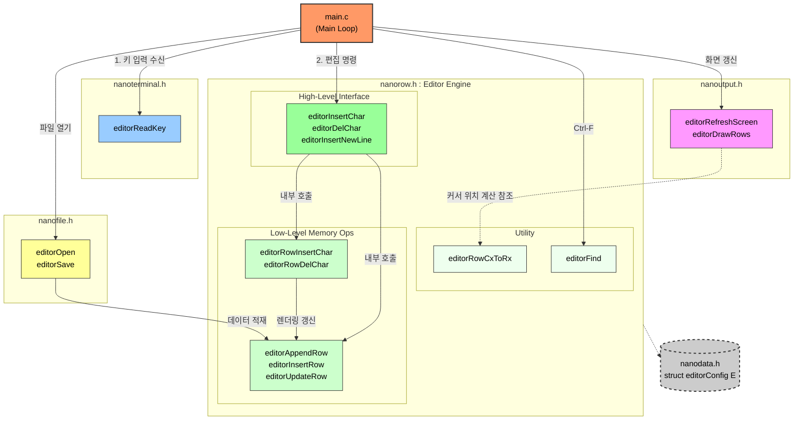

```mermaid
graph TD
    %% 스타일 정의
    classDef main fill:#f96,stroke:#333,stroke-width:2px,color:black;
    classDef term fill:#9cf,stroke:#333,stroke-width:1px,color:black;
    classDef view fill:#f9f,stroke:#333,stroke-width:1px,color:black;
    classDef file fill:#ff9,stroke:#333,stroke-width:1px,color:black;
    classDef rowHigh fill:#9f9,stroke:#333,stroke-width:1px,color:black;
    classDef rowLow fill:#cfc,stroke:#333,stroke-width:1px,color:black;
    classDef rowUtil fill:#efe,stroke:#333,stroke-width:1px,color:black;
    classDef data fill:#ccc,stroke:#333,stroke-width:2px,stroke-dasharray: 5 5,color:black;

    %% 메인 컨트롤러
    MAIN["main.c<br/>(Main Loop)"]:::main

    %% 데이터 (기반)
    GlobalE[("nanodata.h<br/>struct editorConfig E")]:::data

    %% nanorow.h 상세 분해
    subgraph ROW_MODULE ["nanorow.h : Editor Engine"]
        direction TB
        
        subgraph HIGH ["High-Level Interface"]
            H_Edit["editorInsertChar<br/>editorDelChar<br/>editorInsertNewLine"]:::rowHigh
        end

        subgraph LOW ["Low-Level Memory Ops"]
            L_Mod["editorRowInsertChar<br/>editorRowDelChar"]:::rowLow
            L_Alloc["editorAppendRow<br/>editorInsertRow<br/>editorUpdateRow"]:::rowLow
        end

        subgraph UTIL ["Utility"]
            U_Calc["editorRowCxToRx"]:::rowUtil
            U_Find["editorFind"]:::rowUtil
        end

        %% 내부 호출 관계
        H_Edit -->|내부 호출| L_Mod
        H_Edit -->|내부 호출| L_Alloc
        L_Mod -->|렌더링 갱신| L_Alloc
    end

    %% 외부 모듈
    subgraph TERM_MODULE ["nanoterminal.h"]
        Input["editorReadKey"]:::term
    end

    subgraph VIEW_MODULE ["nanoutput.h"]
        Draw["editorRefreshScreen<br/>editorDrawRows"]:::view
    end

    subgraph FILE_MODULE ["nanofile.h"]
        FileIO["editorOpen<br/>editorSave"]:::file
    end

    %% 전체 관계 연결
    
    %% 1. 키 입력 처리 흐름
    MAIN -->|1. 키 입력 수신| Input
    MAIN -->|2. 편집 명령| H_Edit
    
    %% 2. 파일 열기 흐름
    MAIN -->|파일 열기| FileIO
    FileIO -->|데이터 적재| L_Alloc

    %% 3. 화면 그리기 흐름
    MAIN -->|화면 갱신| Draw
    Draw -.->|커서 위치 계산 참조| U_Calc

    %% 4. 검색 기능
    MAIN -->|Ctrl-F| U_Find

    %% 데이터 의존성
    ROW_MODULE -.-> GlobalE
```