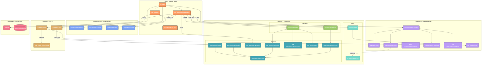

```mermaid
graph TD
    %% ==========================================
    %% 스타일 정의 (가독성을 위한 색상 구분)
    %% ==========================================
    classDef mainNode fill:#ff9e64,stroke:#333,stroke-width:2px,color:white;
    classDef termNode fill:#7aa2f7,stroke:#333,color:white;
    classDef fileNode fill:#e0af68,stroke:#333,color:white;
    classDef viewNode fill:#bb9af7,stroke:#333,color:white;
    classDef rowHigh fill:#9ece6a,stroke:#333,color:white;
    classDef rowUtil fill:#73daca,stroke:#333,color:white;
    classDef rowLow fill:#41a6b5,stroke:#333,color:white;
    classDef dataNode fill:#f7768e,stroke:#333,color:white;

    %% ==========================================
    %% 1. MAIN.C (컨트롤 타워)
    %% ==========================================
    subgraph MAIN_C [main.c : Control Tower]
        direction TB
        M_Main(int main):::mainNode
        M_Init(void initEditor):::mainNode
        M_Proc(void editorProcessKeypress):::mainNode
        M_Move(void editorMoveCursor):::mainNode
    end

    %% ==========================================
    %% 2. NANOTERMINAL.H (입력/시스템)
    %% ==========================================
    subgraph TERM_H [nanoterminal.h : System & Input]
        T_En(void enableRawMode):::termNode
        T_Dis(void disableRawMode):::termNode
        T_Read(int editorReadKey):::termNode
        T_Size(int getWindowSize):::termNode
    end

    %% ==========================================
    %% 3. NANOWROW.H (데이터 로직 엔진)
    %% ==========================================
    subgraph ROW_H [nanorow.h : Data Logic]
        direction TB
        
        subgraph ROW_HIGH [High-level]
            R_DelC(void editorDelChar):::rowHigh
            R_InsC(void editorInsertChar):::rowHigh
        end

        subgraph ROW_UTIL [Utility]
            R_CxRx(int editorRowCxToRx):::rowUtil
            R_Find(void editorFind):::rowUtil
        end

        subgraph ROW_LOW [Low-level]
            R_Upd(void editorUpdateRow):::rowLow
            R_App(void editorAppendRow):::rowLow
            R_InsR(void editorInsertRow):::rowLow
            R_InsNL(void editorInsertNewLine):::rowLow
            R_RDelC(void editorRowDelChar):::rowLow
            R_RAppS(void editorRowAppendString):::rowLow
            R_DelR(void editorDelRow):::rowLow
            R_RInsC(void editorRowInsertChar):::rowLow
        end
    end

    %% ==========================================
    %% 4. NANOOUTPUT.H (화면 출력)
    %% ==========================================
    subgraph OUT_H [nanoutput.h : View & Render]
        direction TB
        O_Scr(void editorScroll):::viewNode
        O_DrawR(void editorDrawRows):::viewNode
        O_Ref(void editorRefreshScreen):::viewNode
        O_SetMsg(void editorSetStatusMessage):::viewNode
        O_DrawS(void editorDrawStatusBar):::viewNode
        O_DrawM(void editorDrawMessageBar):::viewNode
        O_Prompt(char* editorPrompt):::viewNode
    end

    %% ==========================================
    %% 5. NANOFILE.H (파일 입출력)
    %% ==========================================
    subgraph FILE_H [nanofile.h : File I/O]
        F_Open(void editorOpen):::fileNode
        F_Str(char* editorRowsToString):::fileNode
        F_Save(void editorSave):::fileNode
    end

    %% ==========================================
    %% 6. NANODATA.H (공유 데이터 & 에러)
    %% ==========================================
    subgraph DATA_H [nanodata.h : Shared State]
        D_Die(void die):::dataNode
        D_Struct[("struct editorConfig E")]:::dataNode
    end


    %% ==========================================
    %% 관계 연결 (Logic Flow)
    %% ==========================================

    %% 초기화 단계
    M_Main --> M_Init
    M_Main --> T_En
    M_Init --> T_Size
    M_Main --> F_Open

    %% 메인 루프 (입력)
    M_Main --> O_Ref
    M_Main --> M_Proc
    M_Proc --> T_Read

    %% 메인 루프 (동작 분기)
    M_Proc --Arrow Key--> M_Move
    M_Proc --Char Input--> R_InsC
    M_Proc --Delete--> R_DelC
    M_Proc --Enter--> R_InsNL
    M_Proc --Ctrl-S--> F_Save
    M_Proc --Ctrl-F--> R_Find
    
    %% Output 모듈 내부/외부 호출
    O_Ref --> O_Scr
    O_Ref --> O_DrawR
    O_Ref --> O_DrawS
    O_Ref --> O_DrawM
    O_DrawR -.->|Calc Tab| R_CxRx
    R_Find --> O_Prompt

    %% File 모듈 내부/외부 호출
    F_Open -->|Load Data| R_App
    F_Save -->|Serialize| F_Str
    F_Save --> O_Prompt

    %% Row 모듈 계층 구조 (High -> Low)
    R_InsC --> R_RInsC
    R_DelC --> R_RDelC
    R_DelC --> R_RAppS
    R_DelC --> R_DelR
    
    %% Low-level 의존성
    R_RInsC --> R_Upd
    R_RDelC --> R_Upd
    R_App --> R_Upd
    R_InsR --> R_Upd

    %% 전역 에러 처리
    M_Init --> D_Die
```